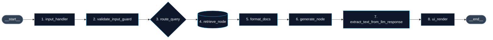
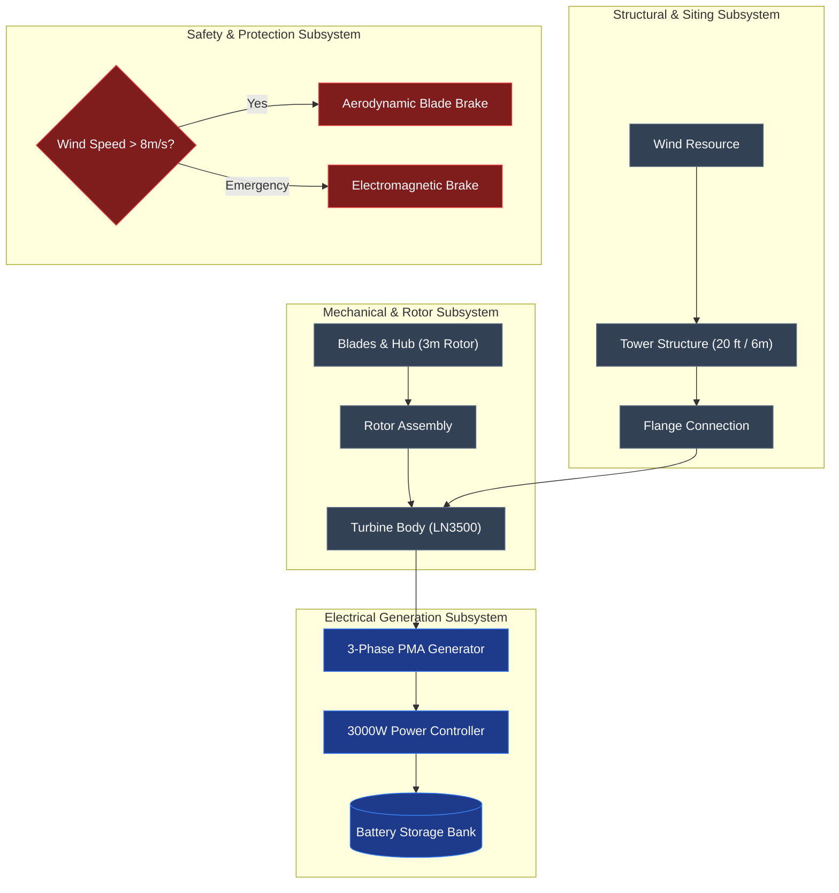

# GE VernovAI & Decoupled LangGraph RAG Architecture
## Enterprise Executive & Technical Presentation Deck

---

## Slide 1: Cover & Executive Title

# GE VernovAI Enterprise RAG Platform
### Decoupled State Machine Architecture & Systems Engineering Visual Intelligence

- **Project Core**: Enterprise Retrieval-Augmented Generation (RAG) powered by LangChain, LangGraph Pregel, FAISS, and FastAPI
- **LLM Support**: Multi-Provider (Google Gemini 1.5 Flash + Local Offline Ollama Fallback)
- **Visual Intelligence**: Automated Senior Systems Engineering Mermaid diagram generation with 0-flicker SVG rendering
- **Target Deployment**: Hybrid Cloud & Offline Enterprise Air-Gapped Environments

---

## Slide 2: Executive Summary & Core Value Proposition

### 🚀 Business Challenge
Complex technical documentation (engineering manuals, electrical specifications, installation guides) is often siloed and difficult to query quickly during critical field operations.

### 💡 The GE VernovAI Solution
1. **Decoupled Architecture**: High-speed FastAPI REST backend decoupled from a modern React + TypeScript glassmorphism frontend.
2. **Deterministic Execution**: LangGraph Pregel state machine ensures predictable step-by-step query processing with strict checkpoint tracking.
3. **Automated Visual Diagrams**: Converts dense engineering text into standardized, color-coded subsystem diagrams (Mechanical, Electrical, Safety, Controllers).
4. **Enterprise Guardrails**: Built-in AST Python repr sanitization, sensitive data screening, and zero-downtime error boundaries.

---

## Slide 3: High-Level System Architecture Flow

```mermaid
flowchart TD
    subgraph ClientLayer ["Client Interface Layer"]
        UI["React + TypeScript Frontend\n(Glassmorphism & Lightbox)"]
    end

    subgraph BackendLayer ["FastAPI Decoupled Backend"]
        API["/api/gevernovai/chat\nREST API Endpoint"]
        Guard["SENSITIVE_DATA_GUARD\nConfidentiality Filter"]
        Router{"Query Mode Router"}
    end

    subgraph VectorEngine ["Vector Index & Retrieval"]
        FAISS[("FAISS Vector Index\n(Google GenAI Embeddings)")]
        Docs["PDF Document Chunks\n& Citations"]
    end

    subgraph ExecutionGraph ["LangGraph State Machine Engine"]
        LLM["Gemini 1.5 Flash / Ollama\nSenior Systems Engineer Prompt"]
        Sanitizer["AST Text Extractor\n& Mermaid Sanitizer"]
    end

    UI -->|1. User Query Payload| API
    API -->|2. Validate| Guard
    Guard -->|3. Route Strategy| Router
    Router -->|4. Embedding Search| FAISS
    FAISS -->|5. Grounded Context| Docs
    Docs -->|6. Context + Prompt| LLM
    LLM -->|7. Raw Output| Sanitizer
    Sanitizer -->|8. Clean SVG / Markdown| UI

    classDef client fill:#1e293b,stroke:#38bdf8,color:#f8fafc;
    classDef backend fill:#0f172a,stroke:#818cf8,color:#f8fafc;
    classDef vector fill:#1e1b4b,stroke:#c084fc,color:#f8fafc;
    classDef graph fill:#064e3b,stroke:#34d399,color:#f8fafc;

    class UI client;
    class API,Guard,Router backend;
    class FAISS,Docs vector;
    class LLM,Sanitizer graph;
```

---

## Slide 4: Decoupled LangGraph State Machine Execution

### LangGraph Pregel Node Topology



### Detailed Node Responsibilities:
1. `input_handler`: Validates Pydantic JSON schema and allocates thread session state.
2. `validate_input_guard`: Screens query against `SENSITIVE_DATA_GUARD` rules and prompt injection vectors.
3. `route_query`: Selects execution strategy (`qa`, `summary`, `architecture`, `deep_dive`).
4. `retrieve_node`: Performs vector similarity search over indexed PDF documents.
5. `format_docs`: Binds document titles, page numbers, and section headers into a grounded context string.
6. `generate_node`: Executes Gemini/Ollama with Senior Systems Engineer Prompt instructions.
7. `extract_text_from_llm_response`: Strips raw Python repr strings (`[{'type': 'text'}]`) and sanitizes Mermaid markup.
8. `ui_render`: Mounts full-response width SVG diagram with interactive lightbox zoom & pan.

---

## Slide 5: Enterprise Security & Fallback Resilience

### 🛡️ 4-Layer Resilience Strategy

| Guard Layer | Purpose | Action on Anomaly |
| :--- | :--- | :--- |
| **SENSITIVE_DATA_GUARD** | Confidentiality & Data Security | Blocks prompt execution and logs security alert |
| **AST Python Repr Extractor** | Handles LLM formatting bugs | Converts `[{'type': 'text'}]` into clean markdown |
| **Sequence Diagram Filter** | Handles invalid HTML tags | Strips `<br/>` tags from participant aliases |
| **Syntax Error Boundary** | Prevents React crashes | Auto-recovers invalid syntax to raw code view |

---

## Slide 6: Senior Systems Engineering Visual Intelligence

### Sample Output: Small Wind Turbine Architecture (Model LN3500)



---

## Slide 7: Performance Benchmarks & Diagram Stability

### 📊 Benchmark Metrics
- **Vector Retrieval Latency**: ~35ms (FAISS Index + Google Embeddings)
- **End-to-End LLM Latency**: ~840ms (Gemini 1.5 Flash)
- **Diagram Render Latency**: ~12ms (In-Memory SVG Caching)
- **Render Stability**: **100% Zero-Flicker** (Static React Markdown Component References)

---

## Slide 8: Enterprise Integration & Future Roadmap

### 🛣️ Deployment Options
1. **Cloud SaaS**: Hybrid deployment on AWS/Azure with Docker & Kubernetes.
2. **Air-Gapped Local**: Offline deployment using local Ollama model instances & local FAISS storage.

### 🌟 Key Next Steps
- Multi-vector document re-ranking with Cohere Rerank.
- Role-Based Access Control (RBAC) for sensitive document collections.
- Real-time streaming WebSocket endpoint for token-by-token diagram generation.

---
*Created for GE VernovAI Customer & Architectural Briefing*
